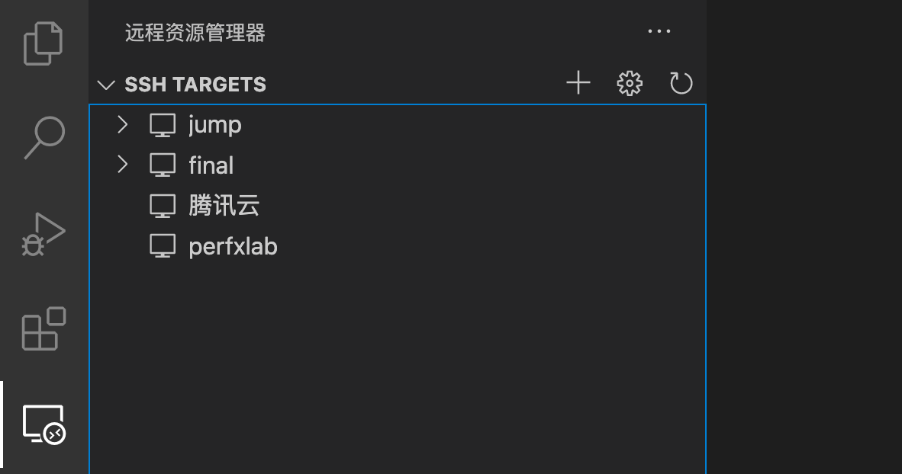
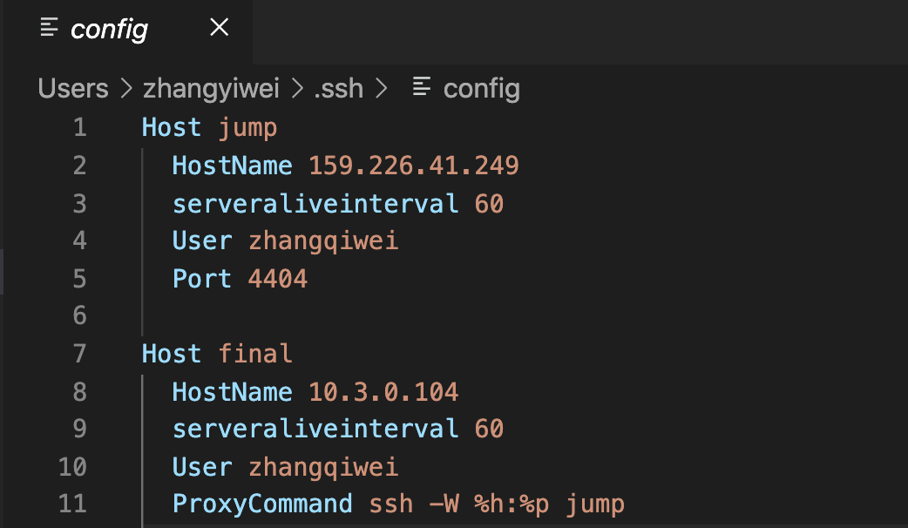
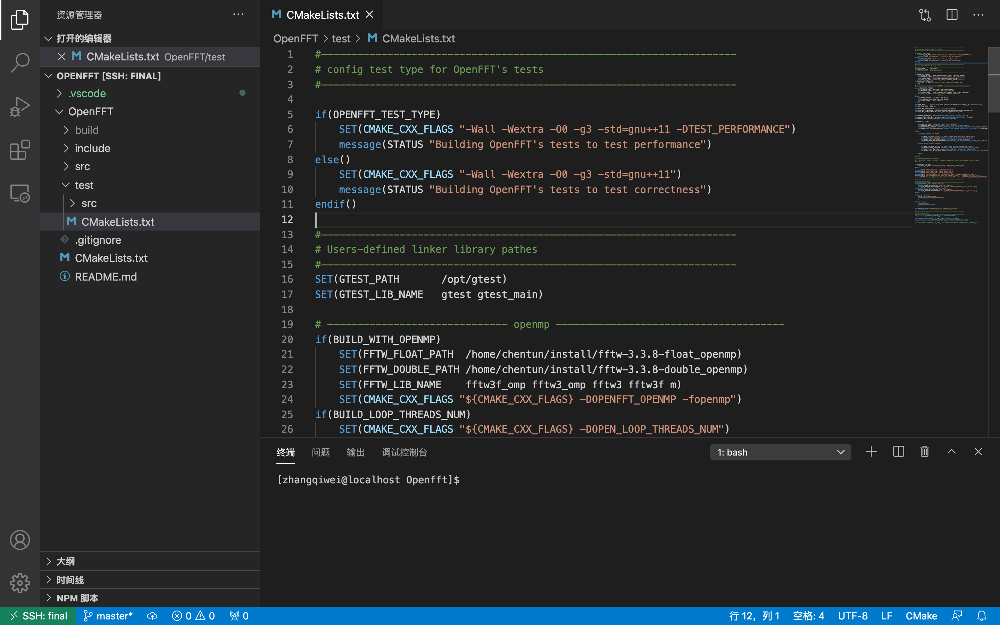

# 前言

最近在做毕设，要在服务器上修改fft代码，突然想起了这部分，于是再整理下，以做记录。

# ssh指令

Secure Shell是一种加密的网络传输协议，可在不安全的网络中为网络服务提供安全的传输环境。SSH通过在网络中创建安全隧道来实现SSH客户端与服务器之间的连接。SSH最常见的用途是远程登录系统，人们通常利用SSH来传输命令行界面和远程执行命令。

----维基百科

常用指令

```bash
ssh Username@Hostname -p Port
```

# VSCode配置远程

首先安装ssh插件 Remote - SSH

之后配置SSH TARGETS。

#### 1. 直接连接

比较简单的话直接添加配置即可，点击+即可。



然后键入之前提到的

```bash
ssh Username@Hostname -p Port
```

再输入密码即可。

#### 2. 跳板机

如需跳板机(jumpserver)连接的话，则需配置config，在mac端我选择的是配置` ~/.ssh/config`，事实上这个文件即是控制上图中SSH TARGETS部分的remote的。

配置文件示例如下：



一般格式如下：

```bash
Host anything
	HostName 		yourhost
	User	 		youruser
	Port	 		default 22
	ProxyCommand 	ssh -W %h:%p jumpname
```

其中Host为你任意命名的，HostName,User,Port为Remote的ip,用户名和端口。之后若本机器是需要通过跳板机跳转的，则添加ProxyCommand（这应该是较复杂的指令，不过我没详细了解），指令如上，jumpname即为设置的跳板机的名字。

最后效果如图：



## 远程无密码登陆

另外感觉每次登录的时候都要设置密码比较麻烦，则在此设置下不需密码即可登陆。在Linux 系统中设置 SSH 免密登录，需要生成公共身份验证密钥并将其附加到远程主机 `/.ssh/authorized_keys` 文件。步骤如下：

1. 首先检查本地是否有SSH密钥对

   ```bash
   ls -al ~/.ssh/id_*.pub
   ```

   如果有显示则可以直接使用，否则即没有密钥，需要先进行配置。

   使用如下命令可以生成SSH密钥对

   ```bash
   ssh-keygen -t rsa -C "user@email.com"
   ```

   按 Enter 接受则默认文件位置和文件名。默认路径在

   ```bash
   /home/username/.ssh/id_rsa
   ```

2. 之后将公钥复制到要管理的主机上。

   可以使用如下指令复制：

   ```bash
   ssh-copy-id Remote@Hostname -p Port
   ```

   之后输入Remote的密码。

   如果上述指令失败，也可以手动复制，如下：

   ```bash
   cat ~/.ssh/id_rsa.pub | ssh remote@hostname
   "mkdir -p ~/.ssh && cat >> ~/.ssh/authorized_keys"
   ```

3. 之后即可使用SSH密钥进行登陆而无需输入密码。

## CLion上的远程

经过长时间的资料查询，我并没找到很好用的CLion功能..即满足远程debug，在线编辑和高亮显示、引用跳转这些。

前两个似乎倒是可以做到，但VSCode似乎也可以...

另外其deployment似乎是在远程部署，即将本地代码copy到remote，目前对我来说无太大功能。

之后如果想起来，或者有大佬指导再弄这个吧..我还是喜欢CLion(x。

